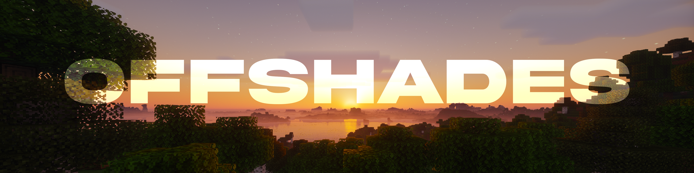

  

> A custom Minecraft shaderpack built from scratch — blending the vanilla-faithful style of **Complementary Reimagined** with the atmospheric richness of **Photon Shaders**.

OffShades is an experimental shaderpack focused on warm skies, readable vanilla-style terrain, and atmospheric lighting without losing Minecraft's identity.

## ✨ Artistic Direction

| Feature | Goal |
|---|---|
| **Terrain** | Vanilla block feel, readable textures |
| **Sky & Atmosphere** | Soft atmospheric scattering, beautiful sunrises/sunsets, Vanilla clouds |
| **Water** | Clear, semi-realistic, not hyper-realist |
| **Shadows** | Sharp near, soft at distance |
| **Bloom** | Subtle and natural |
| **Clouds** | Slightly volumetric but geometric |
| **Nether** | Solas Shader inspired lava and atmosphere |
| **End** | Iteration Inspired End but with full solar system instead of only saturn |

## 🎨 Inspirations

OffShades is developed from some of the code of the inspirations:

- **[Complementary Reimagined](https://www.complementary.dev/shaders/)** — vanilla-friendly lighting, balanced colors, and strong configurability.
- **[Photon Shaders](https://github.com/RRe36/PhotonShader)** — atmospheric skies, detailed lighting, and cinematic weather effects.
- **[Solas Shader](https://github.com/Septonious/Solas-Shader)** — stylized fantasy lighting, colored light, volumetric effects, and expressive skies. Releases are also available on [Modrinth](https://modrinth.com/shader/solas-shader) and [CurseForge](https://www.curseforge.com/minecraft/shaders/solas-shader).
- **[IterationT / IterationRP](https://www.honski.net/library/minecraft/shaderpacks/iterationt/interationt.html)** — realistic lighting, reflections, and restrained color grading. Community patches and edits can be found in [Erykuuu/IterationRp-SoczystaWolowina-edits](https://github.com/Erykuuu/IterationRp-SoczystaWolowina-edits) and [huj31415/iterationrp-patches](https://github.com/huj31415/iterationrp-patches).

> **Note:** Iteration's original shaderpack is not maintained in an official public GitHub repository. Prefer the author's download page and treat third-party mirrors or patches as community resources.

## 🔧 Compatibility

- **Loader**: [Iris Shaders](https://irisshaders.dev/) 1.7+ (recommended) / OptiFine
- **Minecraft**: 1.20+
- **OpenGL**: 4.0+

## 🚀 Installation

1. Download the latest release (or clone this repo)
2. Place the `OffShades` folder (or `.zip`) in your `.minecraft/shaderpacks/` directory
3. In-game: `Options → Video Settings → Shader Packs → OffShades`

## 📄 License

OffShades is distributed under the **GNU General Public License v3.0 (GPL-3.0)**.
See the [LICENSE](LICENSE) file for the complete terms.

Copyright © Ulyxx3.
